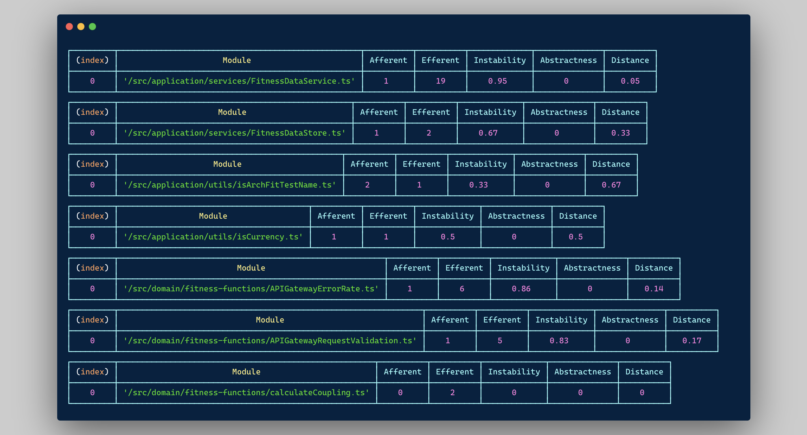

# Codemetrix

## Understand the level of coupling and changeability of your code in a second. 🪄

To truly understand a code base you'll need to know how loose, or coupled, and how apt for change it is.

Codemetrix makes it a jiffy to calculate the "coupling metrics":

- **Afferent coupling**: The number of external modules that depend on a specific module.
- **Efferent coupling**: The number of external modules a specific module depends on.
- **Abstractness**: The proportion of abstract classes/interfaces in a module.
- **Instability**: Measures how much a module is prone to change, calculated as the ratio of efferent coupling to total coupling.
- **Distance from the main sequence**: Indicates the balance between abstractness and instability for a module, helping assess its architectural health.

_Read more about this on [Wikipedia](https://en.wikipedia.org/wiki/Software_package_metrics)._

Here's how [ArchFit](https://github.com/mikaelvesavuori/archfit) looks, in terms of metrics.



It'll also help you get a per-directory overlook of total lines of code in the project, percent that directory takes of all the project's code base, aggregated metrics (afferent/efferent coupling etc.), and also picks out the directories that contain the most of these details.

```json
{
  "results": [
    {
      "directoryPath": "/src/application/services",
      "afferent": 2,
      "efferent": 21,
      "abstractions": 0,
      "concretions": 1,
      "loc": 260,
      "percent": 8.51
    },
    {
      "directoryPath": "/src/application/utils",
      "afferent": 3,
      "efferent": 2,
      "abstractions": 0,
      "concretions": 2,
      "loc": 52,
      "percent": 1.7
    },
    {
      "directoryPath": "/src/domain/fitness-functions",
      "afferent": 14,
      "efferent": 79,
      "abstractions": 7,
      "concretions": 23,
      "loc": 1181,
      "percent": 38.63
    },
    {
      "directoryPath": "/src/domain/services",
      "afferent": 2,
      "efferent": 28,
      "abstractions": 0,
      "concretions": 2,
      "loc": 275,
      "percent": 9
    },
    {
      "directoryPath": "/src/errors",
      "afferent": 9,
      "efferent": 0,
      "abstractions": 0,
      "concretions": 0,
      "loc": 109,
      "percent": 3.57
    },
    {
      "directoryPath": "/src",
      "afferent": 0,
      "efferent": 5,
      "abstractions": 0,
      "concretions": 2,
      "loc": 86,
      "percent": 2.81
    },
    {
      "directoryPath": "/src/infrastructure/aws",
      "afferent": 20,
      "efferent": 28,
      "abstractions": 0,
      "concretions": 15,
      "loc": 684,
      "percent": 22.37
    },
    {
      "directoryPath": "/src/infrastructure/utils/io",
      "afferent": 3,
      "efferent": 7,
      "abstractions": 0,
      "concretions": 3,
      "loc": 40,
      "percent": 1.31
    },
    {
      "directoryPath": "/src/infrastructure/utils/math",
      "afferent": 12,
      "efferent": 0,
      "abstractions": 0,
      "concretions": 3,
      "loc": 27,
      "percent": 0.88
    },
    {
      "directoryPath": "/src/infrastructure/utils/string",
      "afferent": 22,
      "efferent": 0,
      "abstractions": 0,
      "concretions": 2,
      "loc": 25,
      "percent": 0.82
    },
    {
      "directoryPath": "/src/infrastructure/utils/time",
      "afferent": 10,
      "efferent": 2,
      "abstractions": 0,
      "concretions": 9,
      "loc": 83,
      "percent": 2.72
    },
    {
      "directoryPath": "/src/interfaces",
      "afferent": 56,
      "efferent": 16,
      "abstractions": 12,
      "concretions": 0,
      "loc": 235,
      "percent": 7.69
    }
  ],
  "totalLinesOfCode": 3057,
  "loc": "/src/domain/fitness-functions",
  "afferent": "/src/interfaces",
  "efferent": "/src/domain/fitness-functions",
  "abstractions": "/src/interfaces",
  "concretions": "/src/domain/fitness-functions"
}
```

## What to know

Codemetrix is totally dependency-free and is super lightweight. There are also no remote calls or anything going on, just plain old static file analysis.

Note also that the current implementation is focused entirely on TypeScript, but it shouldn't be impossible to extend to support other languages as well. Be my guest and come with a pull request if you want broader language support!

## Prerequisites

Codemetrix assumes you have [Node](https://nodejs.org/en) installed, ideally of a newer version.

To build and test the code, you will need Node 19 or later.

## Installation

You _could_ download the compiled file, `dist/index.mjs`, and follow the instructions below. This is good if you're not big on Git.

_But the nicer option is to clone this repo and use the `install.sh` script._

It will:

- Make a root level directory named `.codemetrix`
- Copy `codemetrix.sh` to the new directory
- Add a line to your `.zshrc` with an alias (`codemetrix`) that runs the script

Feel free to modify the installation script or do it your way if this doesn't match how you'd like it to be set up.

You will need to source or reload your IDE for the changes to be activated.

## Usage

Run `codemetrix` in a Git repository. It will assume source code is in the `src` directory.

To supply it with another directory, run `codemetrix YOUR_DIRECTORY`.

## Contributing

There is a dedicated [CONTRIBUTING.md](CONTRIBUTING.md), but generally I'm happy to take suggestions and proposals for new features!
